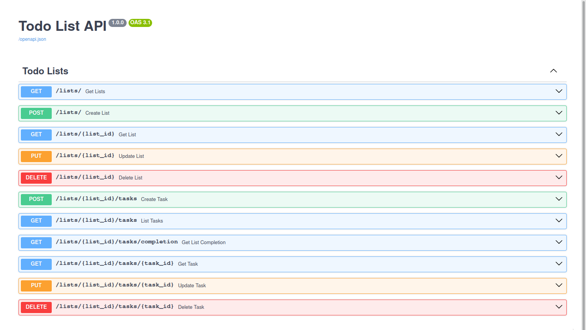
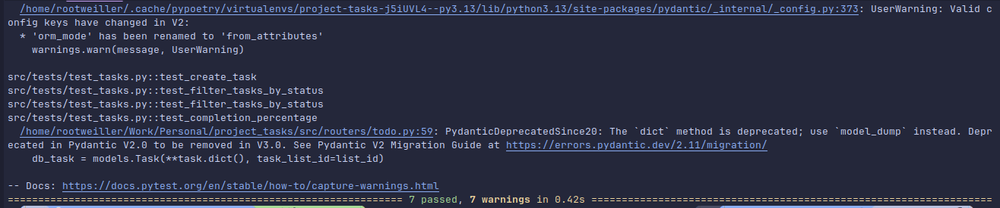

# 📝 Todo API with FastAPI, SQLite, Docker and Poetry

This is a simple yet powerful **Todo List API** built with [FastAPI](https://fastapi.tiangolo.com/), [SQLite](https://www.sqlite.org/), [SQLAlchemy](https://www.sqlalchemy.org/), [Alembic](https://alembic.sqlalchemy.org/) and managed with [Poetry](https://python-poetry.org/).

It allows you to:
- Create, update, delete task lists
- Add, update, delete tasks inside each list
- Change the status of tasks
- Filter tasks by status and priority
- Get completion percentage of tasks in a list

---

## 🚀 Getting Started

### 📦 Clone the repository

```bash
git clone https://github.com/your-username/project_tasks.git
cd project_tasks
```

---

## 🐳 Run with Docker

You need Docker and Docker Compose installed.

### 🔨 Build the container

```bash
docker-compose build
```

### ▶️ Run the application

```bash
docker-compose up --build -d
```

The API will be available at:

```
http://localhost:8000/docs
```


---

## 🧪 Run tests with Poetry

This project uses **SQLite in-memory** and **Pytest** for testing.

### 📌 Install dependencies

If you haven't yet:

```bash
poetry install
```

### ✅ Run tests

```bash
poetry run pytest
```



---

## ⚙️ Database and Migrations

Migrations are managed with **Alembic**.

### Generate a migration

```bash
poetry run alembic revision --autogenerate -m "initial schema"
```

### Apply the migration

```bash
poetry run alembic upgrade head
```

By default, the project uses a local SQLite database: `sqlite:///./app.db`

---

## 🗂️ Project structure

```
app/
├── api.py           # FastAPI app entrypoint
├── models.py        # SQLAlchemy models
├── schemas.py       # Pydantic schemas
├── database.py      # DB connection & get_db
└── routers/
    └── todo.py      # Main task list routes

alembic/             # Alembic migrations
tests/               # Unit and integration tests
Dockerfile
docker-compose.yml
pyproject.toml       # Poetry config
```

---

## 📌 Requirements

- Python 3.13
- Poetry
- Docker (for container usage)

---

## 📫 Author

Made with ❤️ by [Juan Vargas](https://github.com/rootweiller)

---

## 📝 License

MIT License